# Project Writeup - Sensor Fusion

## Mid-term Project: 3D Object Detection

The mid-term project is divided into 4 sections:
* Computing a Lidar Point-Cloud (PCL) from a Range Image (ID_S1_EX1 & ID_S1_EX2)
* Creating a Birds-Eye View (BEV) from a Lidar PCL (ID_S2_EX1 - ID_S2_EX3)
* Model-based Object Detection in the BEV Image (ID_S3_EX1 & ID_S3_EX2)
* Performance Evaluation for Object Detection (ID_S4_EX1 - ID_S4_EX3)

### Setup & Usage

Please refer to Udacity's [README](README.md) file for general setup, requirements and dependencies. 

To run the code, execute the `loop_over_dataset.py`, e.g. via:
````
python -m loop_over_dataset
````
Within `loop_over_dataset.py`, please set the variable `exercise` in line 56 to the respective exercise ID (e.g. "ID_S4_EX1").

This way, you can set the script to execute different routines on selected measurement sequences from the [Waymo Open Dataset](https://waymo.com/open/) 
with adjustable settings, e.g. loading detections from file a pre-trained model or executing the object detection using a pre-trained model.

Outputs used for the project evaluation are stored within the `custom_plots` folder.

In order to jump to the respective code written for an exercise, a file search can be performed using the exercise ID.

### Results

Below images are example outputs deriven from executing `loop_over_dataset.py` with the given parameters for each exercise.

#### Computing a Lidar Point-Cloud (PCL) from a Range Image (ID_S1_EX1 & ID_S1_EX2)

Please refer to the next chapter for a detailed Evaluation of a point cloud visualizations.

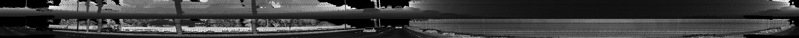
*range image with height (top) and intensity (bottom) for a frame in measurement sequence 1*


*top view of the respective point cloud (PCL) for a frame in measurement sequence 3*

#### Creating a Birds-Eye View (BEV) from a Lidar PCL (ID_S2_EX1 - ID_S2_EX3)

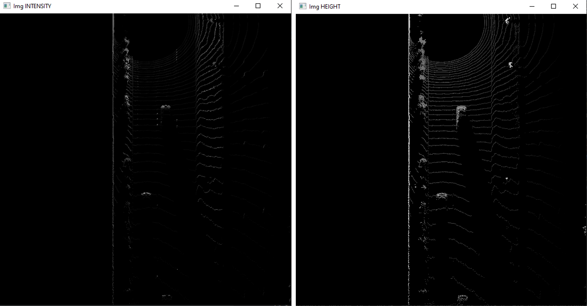
*intensity and height channel of the BEV map for a frame in measurement sequence 1*

#### Model-based Object Detection in the BEV Image (ID_S3_EX1 & ID_S3_EX2)


*objects visible in the camera image and the respective BEV for a frame in measurement sequence 1 (resnet)*

#### Performance Evaluation for Object Detection (ID_S4_EX1 - ID_S4_EX3)

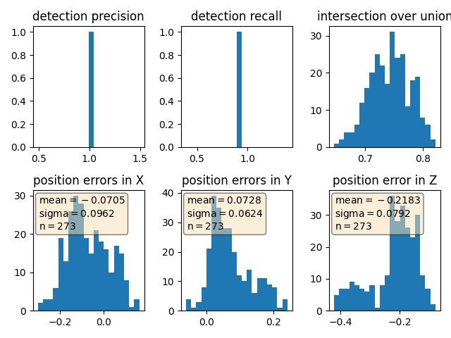
*performance results for 100 example frames for measurement sequence 1 (resnet)*


*precision & recall value for 100 example frames for measurement sequence 1 (resnet)*

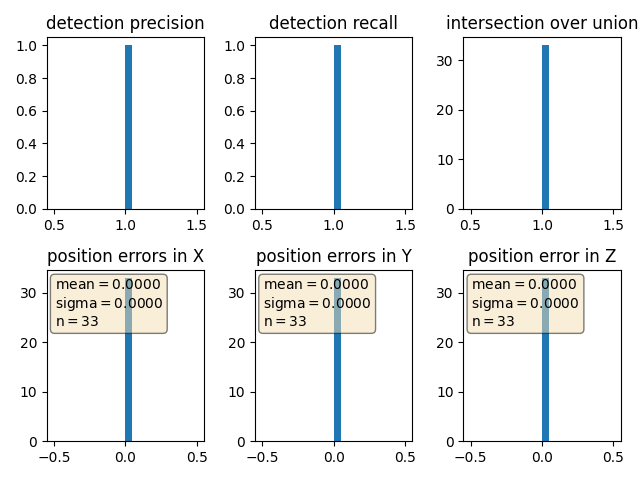
*performance results validation using the ground truth labels for 10 frames in measurement sequence 1*


*performance results validation using the ground truth labels for 10 frames in measurement sequence 1*

### Evaluation

#### Vehicle & Feature Visibility in the Point Cloud and Intensity Channel

The top view of the point cloud (PCL) for measurement sequence 3 reveals the Self-Driving Car (SDC) to be in the middle of a crossroad, on its way to leave it.

While the lane the SDC is driving on seems to be free in the area directly in front of the SDC, 
multiple vehicles can be seen in the scene in general.
in front of the the SDC, there are a couple of vehicles in close distance, going both in the neighbouring and oncoming lane.
In the back and on the sides, there are multiple vehicles approaching the crossroad, as well as some vehicles standing on what seems to be a parking lot:


*Top view of the point cloud (left) with examples of visible vehicles (right)*


*360° height/intensity map*

Depending on their distance and position, vehicles have varying degrees of visibility in the point-cloud (PCL).
Some of the most obvious observations include:

The nearest vehicle in the front left (1) is only partly visible because of its close distance to the SDC - 
its lower features are in the "blind spot" of the top-mounted LiDAR, obstructed by the SDC itself.
The vehicles behind (1) are partly obstructed by it, so mostly features in a higher z-plane, like side mirrors or the A pillar are visible (2).
In contrast, the second vehicle in the front of the SDC (3) is almost fully visible - even the wheel shapes can be distinguished, making this the most easily visible vehicle in the PCL:


*Detailed view of the scene in front of the SDC, containing multiple vehicles with varying visibility*

Detailed features can also be identified on the vehicle in the front right (4) - its overall shape clearly gives it away as a pickup truck pulling an empty trailer.
Due to the offset position to the right, detailed shapes such as the wheels and wheel covers can be distinguished on the trailer.
Interestingly though, the wheels and rearview mirrors on the pickup truck are less distinguishable in the intensity map than in the PCL:


*Pickup truck (4) with trailer in front of the SDC*

In the lower left of the top view (in the back-view of the SDC), there seems to be a vehicle (5) which is obstructed by what seems to be a reflective object (e.g. a traffic sign) with very high intensity- 
it is not very well distinguishable in the point cloud  by itself, but casts a clearly distinguishable "shadow" to the background in the intensity map:


*vehicle obstructed by reflective object (5)*

Facing to the left, there are some vehicles on what seems to be a parking lot next to the crossroad (6).
While vehicles in the front are still visible, there are a lot more obstructions (e.g. large signs) than on the road - 
Despite that, some distinguishable features are still visible, hence those vehicles might be detected by a suitable object detection algorithm:


*vehicles on a parking lot (6) obstructed by multiple structures on the side of the road*

#### Stable Features

Overall, the metal chassis of the vehicles seems to reflect the LiDAR laser beams very well - especially the vertical structures (sides, front, back) and edges.
Hence, vehicles can easily be detected by their overall shape and size.
In contrast to the chassis, windows seem to let through and refract the laser beams, producing scattered points "inside" the vehicles in the PCL.
The resulting point distribution can be distinguished well from those the metal structures (such as the A-beam) produce.
Windows could thus be regarded as stable features:


*Ego/front view with distinguishable features: wheels (red), rearview mirrors (black) and windows (yellow), with the windshield being the most prominent*

From the intensity channel visualization we can furthermore identify the head and tail lights, license plates and grille as well as the side mirrors as stable features for a vehicle.
The head and tail lights are the most distinguished features and visible even for far away vehicles, probably because of their reflective properties.
If a vehicle is captured from the side by the LiDAR, wheel rims are distinguishable as well:


*Detail views from the height/intensity map, showing the front and back features of vehicles (boxes) and the wheel rime (circles)*

## Final Project: Sensor Fusion and Object Tracking


*Animation for multi-target tracking with sensor fusion in measurement sequence 1*

The mid-term project is divided into 4 sections:
* Implementing an extended Kalman filter (EKF)
* Implementing a track management including track state and track score, track initialization and deletion
* Implementing single nearest neighbour data association and gating
* Apply sensor fusion by implementing the nonlinear camera measurement model and a sensor visibility check

### Setup & Usage

Please refer to Udacity's [README](README.md) file for general setup, requirements and dependencies.

Otherwise, setup and usage for the final project work the same way as for the mid-term project (see above):
to run the code and process each measurement frame, execute the `loop_over_dataset.py` script.

The final project uses *pre-computed lidar detections*, which can be downloaded [here](https://drive.google.com/drive/folders/1IkqFGYTF6Fh_d8J3UjQOSNJ2V42UDZpO), 
in order for all students to have the same input data.

Other relevant files are:

* `student/filter.py` contains the EKF class including the predict and update step
* `student/trackmanagement.py` includes two classes for tracking:
	* class `Track` with attributes **x** and **P** for state and covariance
	* class `Trackmanagement` with a `track_list` to store all tracks, as well as methods to manage tracks
* `student/association.py` includes a class `Association` with logic to associate tracks to measurements and call the EKF update function with these associated measurements in `associate_and_update()`
* `student/measurements.py` includes two classes for measurement handling:
	* class `Sensor` to distinguish between camera and lidar and include the sensor's calibration data, field of view (FOV) and coordinate transforms as well as the EKF measurement model
	* class `Measurement` with the attributes **z** and **R** for the measurement vector and corresponding covariance
* `misc/params.py` includes all parameters for tracking (e.g. timestep, initialization parameters, track management settings, gating threshold)

### Implementation Steps & Results


#### EKF Implementation

In this step, we implemented an Extended Kalman Filter (EKF) to track a single real-world target with lidar measurement input over time.

In particular, we extended the EKF algorithm from the course exercises to **3D space**, 
taking into account also the height "z" (in vehicle coordinates).
Hence, the tracking problem was given by:
* a 6x1 state vector x = (px, py, pz, vx, vy, vz) and 6x6 System Matrix F
* a linear measurement function h(x) = H * x for the lidar sensor, with H being a 3x6 matrix

The `update()` and `predict()` functions of the EKF were implemented using the generic expression `γ = z - h(x)`.
This way, the implementation could directly be applied to the nonlinear camera model later on.

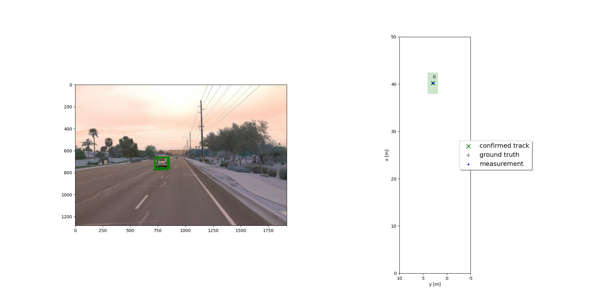
*object bounding box in camera view using an EKF in measurement sequence 2*


*respective Tracking performance given by the Root Mean Square Error (RMSE) in measurement sequence 2*

#### Track Management Implementation

In the second step, we implemented the track management module to initialize and delete tracks, 
set a track state and a track score. This module enables the EKF to track multiple objects simultaneously.
This is achieved by assigning and managing (i.e. evaluating and, if necessary, deleting) detected objects to so-called tracks.

Again, the implementation was at first limited to tracking a single target using the lidar.

The basic approach of the track management module is to assign a **track score**, i.e. an existence probability, 
to a detected object, in order distinguish "ghost detections/clutters" (FP) from true positives (TP).
Based on that score, the track is assigned a **state** ('initialized', 'tentative' or 'confirmed').

Track deletion was then implemented using a heuristic working with this score and state.
For deleting tracks, we mostly used the parameters from the course exercises: 
a score threshold and the position uncertainty P in the x-y-plane, set to a 3m radius.

While the threshold score for confirmed tracks was kept at 0.6, 
the threshold for initialized or tentative tracks was lowered to 0.1-0.15 to allow for new tracks to be initialized properly.

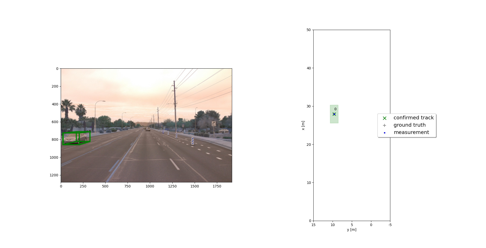
*confirmed object in camera view using Track Management in measurement sequence 2*

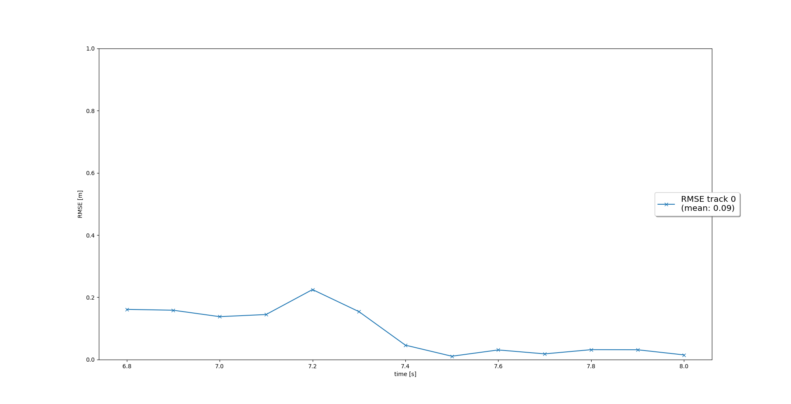
*respective Tracking performance given by the Root Mean Square Error (RMSE) in measurement sequence 2*

#### Single Nearest Neighbour (SNN) Data Association & Gating Implementation

In the third step, we extended our tracking algorithm with a single nearest neighbour association (SNN)
and applied it to multiple targets.

The implemented association module is based on **Mahalanobis distances**.
This approach iteratively maps the closest measurement and track together using their position uncertainty 
(i.e. the residual γ and the estimation error covariance in measurement space S).

This is achieved using an **association matrix A** containing the Mahalanobis distances. 
For each frame, A is used to create a 1:1 mapping between measurements and existing tracks, 
until no more matches are possible.
Furthermore, a gating method with a chi-square-distribution was implemented to reduce complexity.

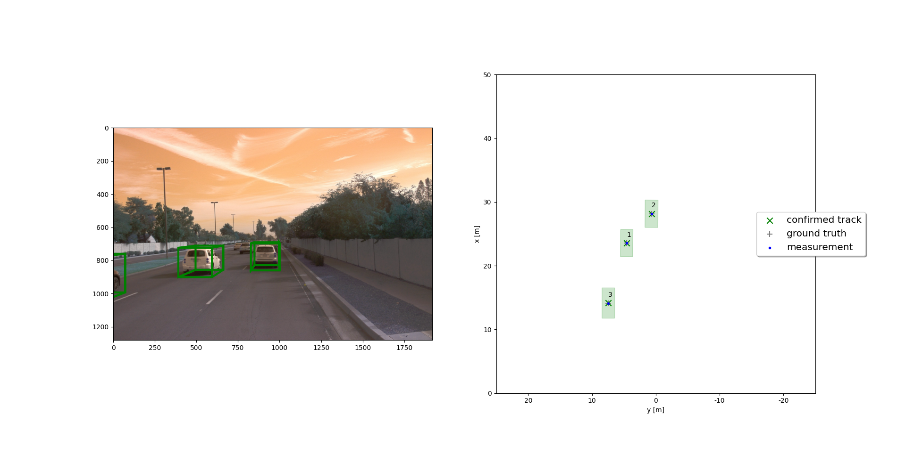
*Multi-target tracking using SNN and gating in measurement sequence 1 (frames 50-100)*

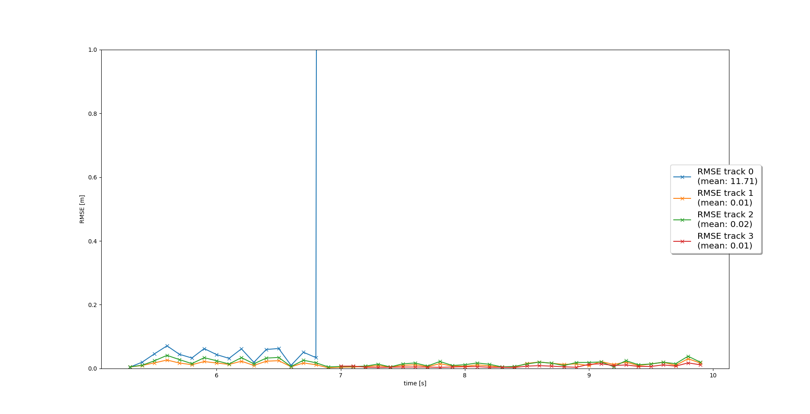
*Multi-target tracking performance given by the Root Mean Square Error (RMSE) in measurement sequence 1 (frames 50-100)*

#### Sensor Fusion Implementation

In the final step, we implemented the nonlinear camera model and included the camera's field of view (FOV), 
thus enabling a full camera-lidar sensor fusion within our multi target tracking algorithm.
The tracking loop now updates all tracks with lidar measurements, then with camera measurements.

Within the EKF, the nonlinearity of the measurement function h(x) must now be taken into account.

In the final implementation, it can be seen that for all ground truth objects, 
our multi-target track management initializes, manages and deletes tracks as defined in the previous exercises:

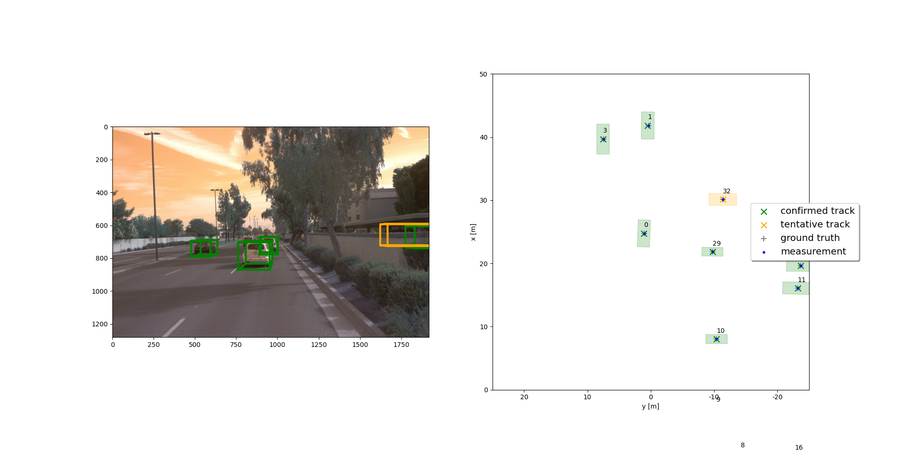
*Multi-target tracking with sensor fusion - output in measurement sequence 1*

Two objects, managed as track 0 and track 1, are present in all frames of the chosen measurement sequence 1, 
with a tracking performance of 0.12 and 0.07 m, respectively:

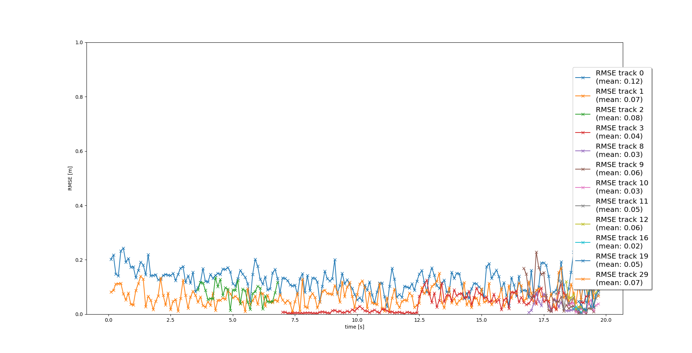
*Multi-target tracking with sensor fusion - performance in measurement sequence 1*

### Evaluation

#### Implementation

During implementation, debugging was the most time-consuming part. Careful consideration 
had to be paid to the coordinate transformations between sensor and vehicle space.
Implementing the sensor fusion system step-by-step helped to to identify error sources.

The course exercises however made me feel well-prepared for implementing the overall approach.

#### Do you see any benefits in camera-lidar fusion compared to lidar-only tracking (in theory and in your concrete results)? 

Fusing the detection results from different sensors, each with their own strength, leads to a more
robust and reliable object detection.

Vehicles might not be detected by the camera at all due to occlusions or adverse light conditions, 
whereas there might be false positives in the lidar measurements due to high reflectivity of an object in the environment.

For self-driving car applications, this improved robustness is an absolute must 
in order to achieve a high enough object detection performance to fulfill safety regulations and 
perform correctly in many different situations. 

#### Which challenges will a sensor fusion system face in real-life scenarios?

In real world scenarios, the behaviour of dynamic objects is very complex to model.
We chose a rather general motion model here, 
which might be oversimplified for some use cases (urban environment vs. highway).

Furthermore, we only applied our algorithm to the detection of vehicles. 
Other dynamic objects such as bycicles or pedestrians might require more complex motion models and 
parameterization for the SDC to react accordingly 
(e.g. not to perform an emergency braking for a pedestrian standing at a red light, 
but performing one for the child that suddenly steps on the road)

#### Improvements

As outlined in the course, there are multiple approaches to improve the sensor fusion approach.

In our sensor fusion system, we chose a simple SNN approach for our track association module.
This approach does not yield the global optimum of associations between measurements and tracks and 
enforces a hard decision in ambiguous situations.
More sophisticated algorithms mentioned in the course, such as GNN and PDA, could lead to improvements here.

A nonlinear motion model which takes into account the restrictions of motion imposed on a vehicle (no sideways motion, road-wheel contact etc.),
could yield better results in filtering and tracking.

Within the EKF itself, the choice of parameters such as process and measurement noise covariances **Q** and **R** could be refined, 
e.g. by conducting test drives or by using our results from the midterm project.
Additionally, the time step **dt** could be chosen smaller,
thus reducing the deviation between the prediction and measurements even for an inaccurate motion model.

In general, the object detection algorithm could be optimized as well,
which would relieve the sensor fusion system from handling to many false positive detections.

