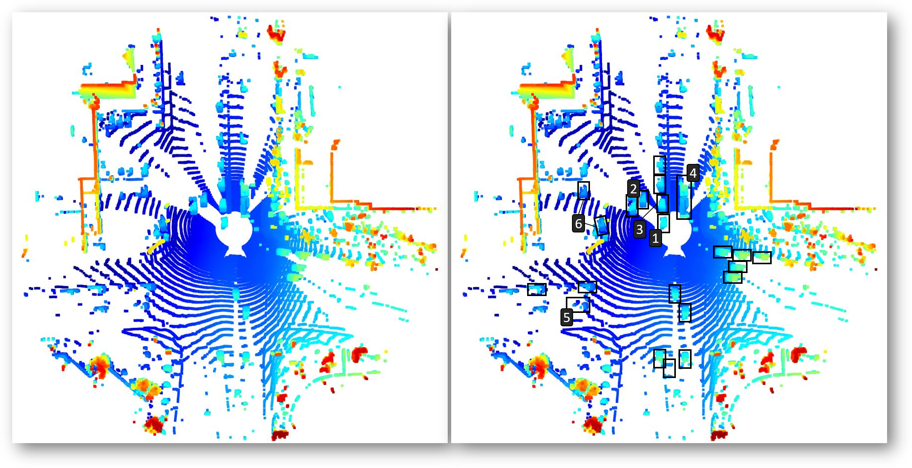

# Project Writeup - Sensor Fusion

## Mid-term Project: 3D Object Detection

The mid-term project is divided into 4 sections:
* Computing a Lidar Point-Cloud (PCL) from a Range Image
* Creating a Birds-Eye View (BEV) from a Lidar PCL
* Model-based Object Detection in the BEV Image
* Performance Evaluation for Object Detection

### Setup & Usage

Please refer to Udacity's [README](README.md) file for general setup, requirements and dependencies. 

To run the code, execute the `loop_over_dataset.py`, e.g. via:
````
python -m loop_over_dataset
````
Within `loop_over_dataset.py`, please set the variable `exercise` in line 56 to the respective value.

Outputs used for the project evaluation are stored within the `custom_plots` folder.

### Evaluation

#### Vehicle & Feature Visibility in the Point Cloud and Intensity Channel

The top view of the point cloud for measurement sequence 3 reveals the Self-Driving Car (SDC) to be in the middle of a crossroad, on its way to leave it.
While the lane the SDC is driving on seems to be free in the area directly in front of the SDC, multiple vehicles can be seen in the scene in general:
in front of the the SDC, there are a couple of vehicles in close distance, going both in the neighbouring and oncoming lane.
In the back and on the sides, there are multiple vehicles approaching the crossroad, as well as some vehicles standing on what seems to be a parking lot:


*Top view of the point cloud (left) with examples of visible vehicles (right)*


*360° height/intensity map*

Depending on their distance and position, vehicles have varying degrees of visibility in the point-cloud (PCL).
Some of the most obvious observations include:

The nearest vehicle in the front left (1) is only partly visible because of its close distance to the SDC - 
its lower features are in the "blind spot" of the top-mounted LiDAR, obstructed by the SDC itself.
The vehicles behind (1) are partly obstructed by it, so mostly features in a higher z-plane, like side mirrors or the A pillar are visible (2).
In contrast, the second vehicle in the front of the SDC (3) is almost fully visible - even the wheel shapes can be distinguished, making this the most easily visible vehicle in the PCL:


*Detailed view of the scene in front of the SDC, containing multiple vehicles with varying visibility*

Detailed features can also be identified on the vehicle in the front right (4) - its overall shape clearly gives it away as a pickup truck pulling an empty trailer.
Due to the offset position to the right, detailed shapes such as the wheels and wheel covers can be distinguished on the trailer.
Interestingly though, the wheels and rearview mirrors on the pickup truck are less distinguishable in the intensity map than in the PCL:


*Pickup truck (4) with trailer in front of the SDC*

In the lower left of the top view (in the back-view of the SDC), there seems to be a vehicle (5) which is obstructed by what seems to be a reflective object (e.g. a traffic sign) with very high intensity- 
it is not very well distinguishable in the point cloud  by itself, but casts a clearly distinguishable "shadow" to the background in the intensity map:


*vehicle obstructed by reflective object (5)*

Facing to the left, there are some vehicles on what seems to be a parking lot next to the crossroad (6).
While vehicles in the front are still visible, there are a lot more obstructions (e.g. large signs) than on the road - 
Despite that, some distinguishable features are still visible, hence those vehicles might be detected by a suitable object detection algorithm:


*vehicles on a parking lot (6) obstructed by multiple structures on the side of the road*

#### Stable Features

Overall, the metal chassis of the vehicles seems to reflect the LiDAR laser beams very well - especially the vertical structures (sides, front, back) and edges.
Hence, vehicles can easily be detected by their overall shape and size.
In contrast to the chassis, windows seem to let through and refract the laser beams, producing scattered points "inside" the vehicles in the PCL.
The resulting point distribution can be distinguished well from those the metal structures (such as the A-beam) produce.
Windows could thus be regarded as stable features:


*Ego/front view with distinguishable features: wheels (red), rearview mirrors (black) and windows (yellow), with the windshield being the most prominent*

From the intensity channel visualization we can furthermore identify the head and tail lights, license plates and grille as well as the side mirrors as stable features for a vehicle.
The head and tail lights are the most distinguished features and visible even for far away vehicles, probably because of their reflective properties.
If a vehicle is captured from the side by the LiDAR, wheel rims are distinguishable as well:


*Detail views from the height/intensity map, showing the front and back features of vehicles (boxes) and the wheel rime (circles)*


[//]: # (#### Object Detection Performance)

[//]: # (You may also consider adding in your performance metrics, but that is not required.)

[//]: # ()
[//]: # (## Final Project )

[//]: # ()
[//]: # (### 1. Tracking Steps)

[//]: # (Write a short recap of the four tracking steps and what you implemented there &#40;filter, track management, association, camera fusion&#41;.)

[//]: # (* Which results did you achieve?)

[//]: # (* Which part of the project was most difficult for you to complete, and why?)

[//]: # ()
[//]: # (### 2. Comparison)

[//]: # (Do you see any benefits in camera-lidar fusion compared to lidar-only tracking &#40;in theory and in your concrete results&#41;? )

[//]: # ()
[//]: # (### 3. Challenges)

[//]: # (* Which challenges will a sensor fusion system face in real-life scenarios?)

[//]: # (* Did you see any of these challenges in the project?)

[//]: # ()
[//]: # (### 4. Improvements)

[//]: # (* Can you think of ways to improve your tracking results in the future?)

[//]: # ()